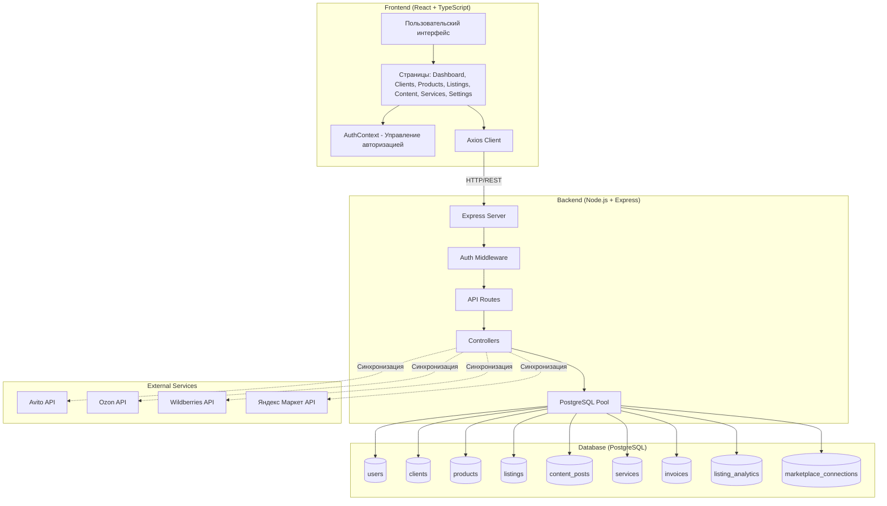
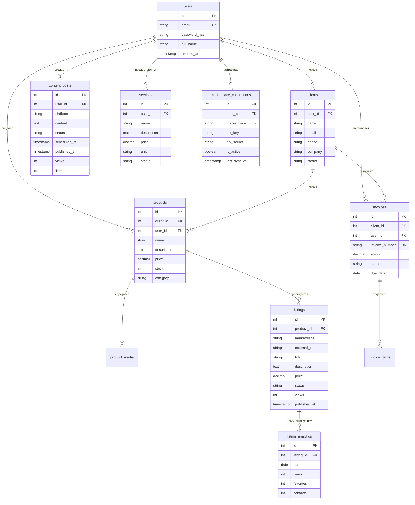
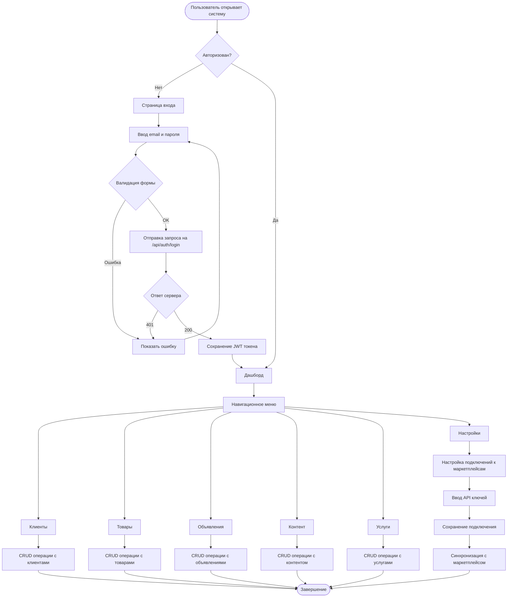
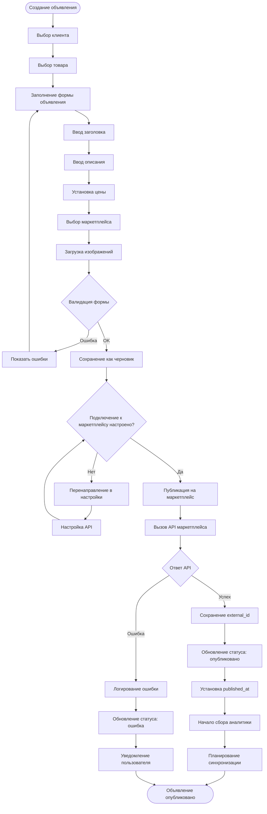
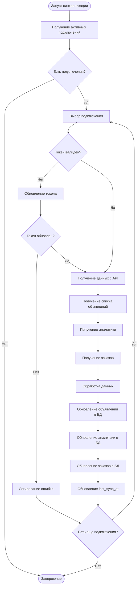
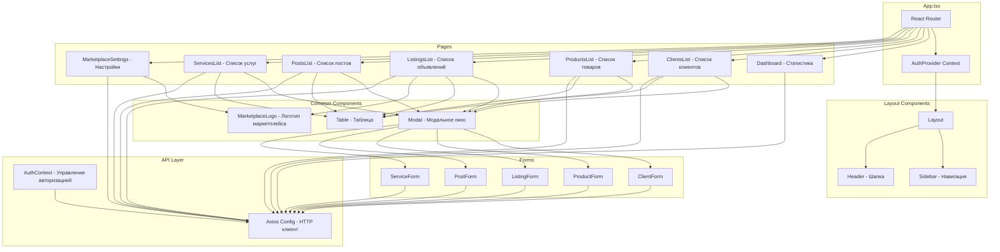
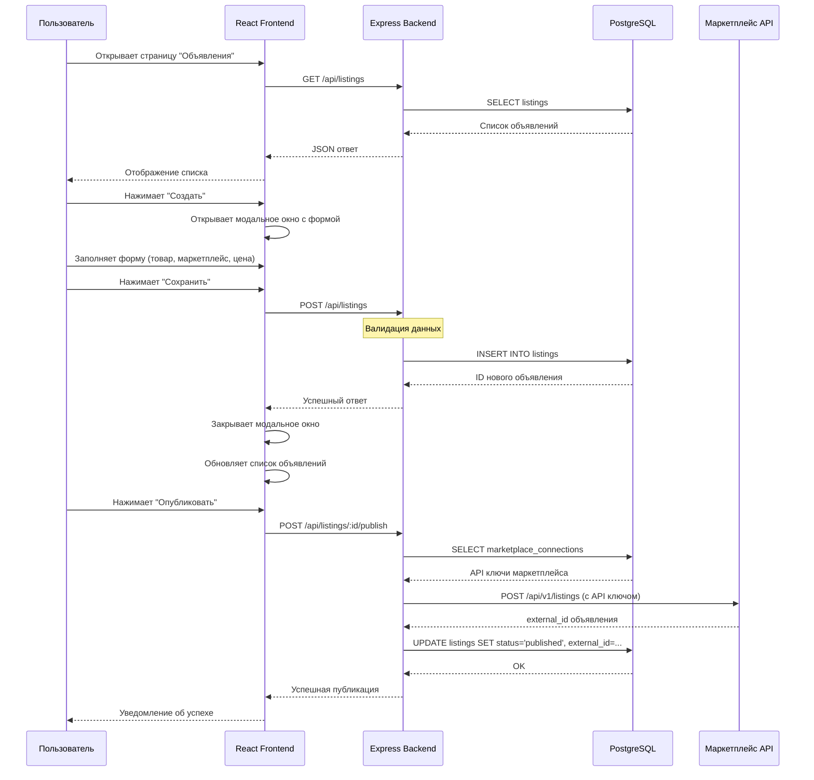
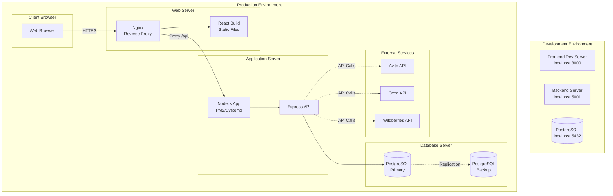

# Диаграммы системы Авитолог

## 1. Архитектура системы

## 2. ER-диаграмма базы данных

## 3. BPMN - Процесс авторизации и работы с системой

## 4. BPMN - Процесс создания и публикации объявления

## 5. BPMN - Процесс синхронизации с маркетплейсами

## 6. Диаграмма компонентов Frontend

## 7. Последовательность действий при создании объявления

## 8. Диаграмма развертывания

## Как использовать

1. Скопируйте любую диаграмму из этого файла
2. Перейдите на https://mermaid.live
3. Вставьте код диаграммы в редактор
4. Диаграмма автоматически отобразится

Все диаграммы готовы к использованию в Mermaid Live Editor!

